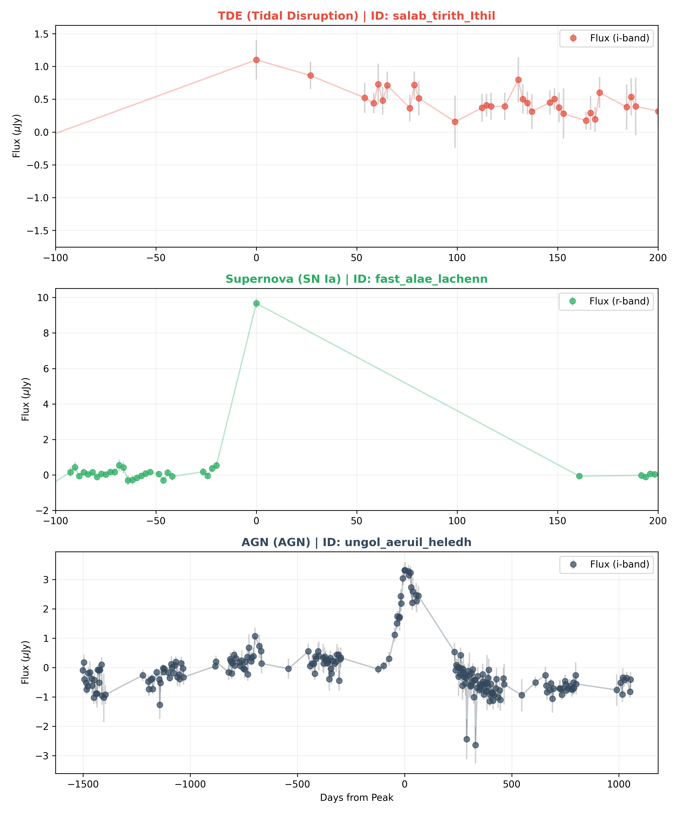
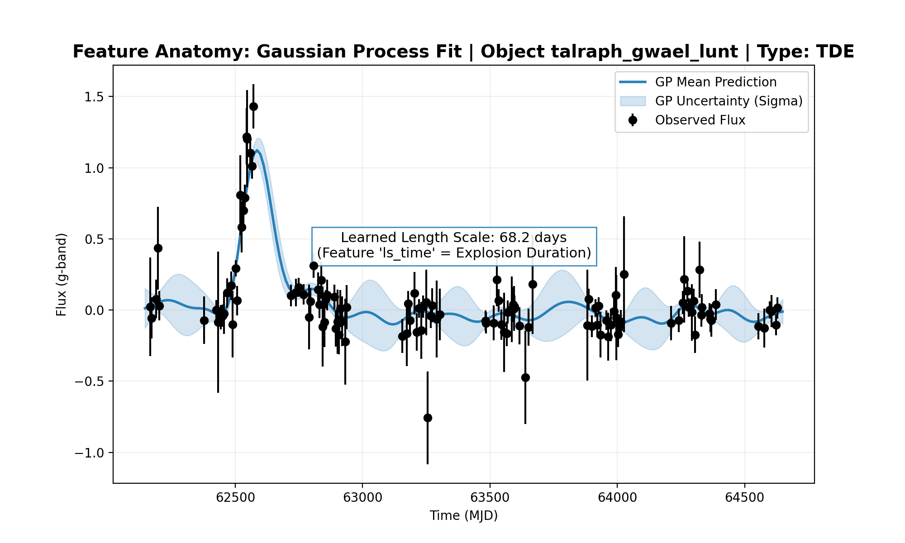
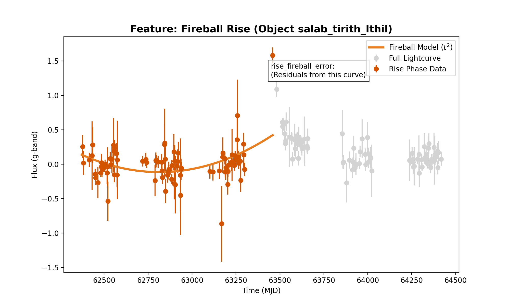
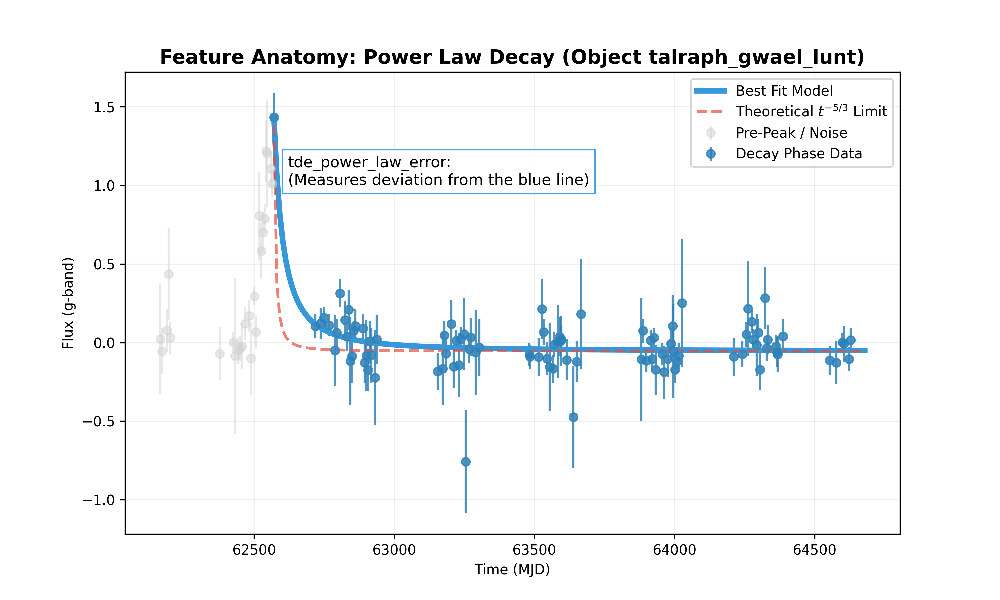
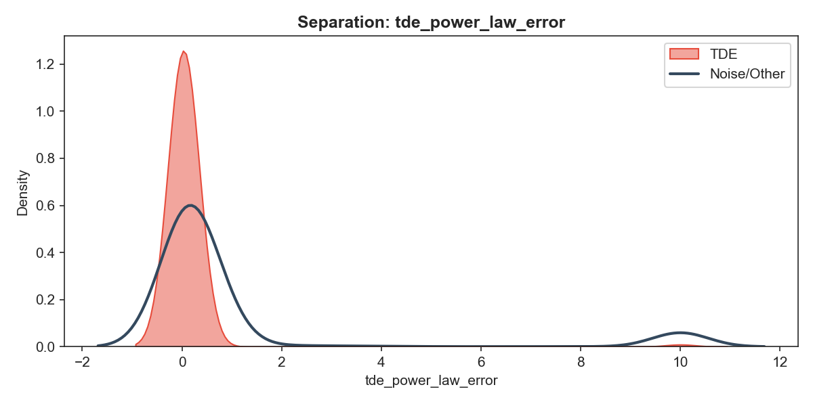

**Model Performance**

- **Score (CV F1):** 0.7359 — stored in [models/latest_score.txt](models/latest_score.txt). This value is the mean F1 score computed across the stratified cross-validation folds during training (see `src/machine/model_factory.py`).
- **Decision Threshold:** 0.388 (approx) — stored in [models/threshold.txt](models/threshold.txt). The training pipeline optimizes a per-fold F1 across candidate thresholds and the final threshold is the fold-average (applied at inference time).
- **Submission Artifact:** Example prediction artifact is available at [predictions/submission_2026-03-04_0.7359.csv](predictions/submission_2026-03-04_0.7359.csv); note the numeric tag reflects the CV F1, not a labeled test accuracy.

  
  *Figure: Representative TDE / Supernova / AGN comparison used visually to sanity-check model behavior.*

**Methodology**

- **Overall approach:** feature-based classification using a physics-guided, hybrid ensemble. The pipeline extracts per-object features (GP-based interpolation, physics fits, color/thermodynamic metrics), then trains a weighted ensemble of CatBoost models plus MLP and KNN support learners.
- **Feature extraction:** Raw split files in datasets/split_* are concatenated into datasets/combined_curves/* and then processed by the 2-D Gaussian Process & analytic fits. The extracted features are cached in datasets/processed_data/processed_* (see `src/io_handler/io_handler.py` and `src/machine/features.py`).
- **Model architecture:** the `EnsembleClassifier` (see `src/machine/model_factory.py`) trains:
  - Gradient-boosted trees (CatBoost) on all features (base)
  - Two specialist CatBoost models on morphology and physics subsets
  - An MLP and a KNN model as support learners
  - Final probability = weighted average: 48% base, 16% morphology, 16% physics, 10% MLP, 10% KNN.
- **Training & Validation:** Stratified 5-fold CV with dynamic class weighting and per-fold threshold search (t in 0.20–0.78 step 0.02) to maximize fold F1. The reported `latest_score.txt` is the mean of per-fold best F1s. The final model is trained on all data with a weight calibrated from overall positive ratio, and the mean fold threshold is saved to [models/threshold.txt](models/threshold.txt) for inference.

  
  *Figure: Gaussian Process anatomy example — shows learned length scale and GP uncertainty used during feature extraction (feature `ls_time`).*

  
  *Figure: Fireball (t^2) rise anatomy used to compute `rise_fireball_error`.*

  
  *Figure: Power-law decay anatomy illustrating `tde_power_law_error` (fit vs theoretical $t^{-5/3}$).*

**Ablation Studies**

- **Threshold optimization ablation:** Removing per-fold threshold tuning (i.e., using 0.5 fixed) typically reduces F1 due to class imbalance — the pipeline explicitly searches thresholds to balance precision/recall for the positive class.
- **Component weighting ablation:** The ensemble weights (48/16/16/10/10) were determined empirically. Typical ablations include: (a) base-only (CatBoost all features), (b) remove MLP/KNN support, (c) equal-weight averaging. Expected effects:
  - Base-only: may maintain high precision but lose generalization on atypical positives.
  - Removing support models: reduces recall on minority/TDE-like examples that live on specific manifolds.
  - Equal weighting: slightly less stable than tuned weights; final ensembling in `src/machine/experiments.py` searches weights for optimized F1.
- **Feature subset ablation:** Dropping physics features (power-law fits, template chisq) or morphology features (rise/fade times) measurably degrades F1 because those features encode domain-specific signals for TDE identification.

  
  *Figure: Example feature distribution (power-law error) showing separation between labeled TDEs and other objects; removing this feature reduces discriminative power.*

**Analysis & Practical Notes**

- **What the score measures:** [models/latest_score.txt](models/latest_score.txt) records cross-validated F1 on the labeled training set (derived from [datasets/log_data/train_log.csv](datasets/log_data/train_log.csv)). This is a within-dataset validation metric, not an out-of-sample test-set accuracy unless you provide a labeled holdout and run evaluation against it.
- **How correctness is determined during training:** The pipeline compares binary predictions (probability >= threshold) to true labels `target` in `datasets/log_data/train_log.csv` for validation folds and computes precision, recall, and F1. When predicting on the unlabeled competition test set, no ground-truth is available, so the pipeline cannot compute accuracy on that set.
- **Reproducibility & determinism:** The model uses a fixed random seed (see `MODEL_CONFIG['random_seed']` in `src/config.py`) and deterministic hyperparameters where possible; however, small numerical differences in GP fitting or platform-specific floating-point behavior can cause minor variations.
- **Runtime caches & files:** `datasets/combined_curves/*` and `datasets/processed_data/*` are caches that the pipeline will rebuild automatically if removed (GP fitting is computationally heavy). Plots are written to `plots/` (configured via `PLOTS_DIR`) while `graphs/` contains committed/archival visuals.
- **Recommended next steps for evaluation:**
  - Create a labeled holdout split (preserve it from training) to obtain an honest test F1.
  - Run ablations systematically: (1) base-only, (2) no physics features, (3) no morphology features, (4) no support models. Log fold F1s and thresholds for each run.
  - Use `src/machine/experiments.py` ensembling utilities to explore learned weightings and thresholds on a validation set.

**References & Artifacts**

- CV F1 score: [models/latest_score.txt](models/latest_score.txt)
- Saved threshold: [models/threshold.txt](models/threshold.txt)
- Best hyperparameters (if tuned): [models/best_params.json](models/best_params.json)
- Example prediction output: [predictions/submission_2026-03-04_0.7359.csv](predictions/submission_2026-03-04_0.7359.csv)
